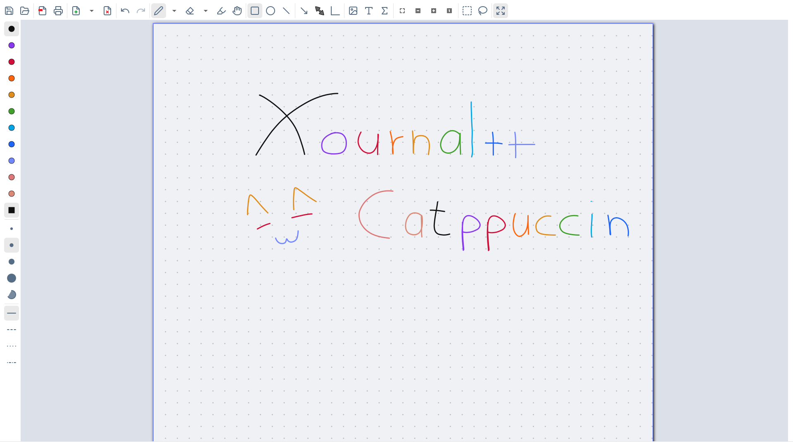

<h3 align="center">
<br/>

  Catppuccin for <a href="https://xournalpp.github.io/">Xournal++</a>

</h3>

<p align="center">

</p>

# About
A soothing pastel theme for <a href="https://xournalpp.github.io/">Xournal++</a> using <a href=https://github.com/catppuccin/catppuccin#-palette>Catppuccin</a> color scheme

# Previews

<details>
<summary>🌻 Latte</summary>

</details>
<details>
<summary>🪴 Frappé</summary>

</details>
<details>
<summary>🌺 Macchiato</summary>

</details>
<details>
<summary>🌿 Mocha</summary>

</details>

# Install
1. Download `toolbar.ini` from this repository and append its content to `~/.config/xournalpp/toolbar.ini`

If the directory doesn't exist, create it with
``` lisp
mkdir ~/.config/xournalpp/
```
2. Choose your preferred flavour from this repository, download `palette.gpl` and place it inside `~/.config/xournalpp/`

3. Install and apply a <a href=https://github.com/catppuccin/gtk>Catppuccin GTK theme</a> (Optional)

# Configuration
<details>
<summary>🌻 Latte</summary>

1. Enable the toolbar from the Menubar

``` lisp
View -> Toolbars -> Catppuccin 
```

2. Change the paper color to `#EFF1F5` from

``` lisp
Journal -> Paper Color
```

3. Open the preferences menu from the Menubar

``` lisp
Edit -> Preferences
```

4. Navigate to the `View` tab and change the following settings:
    - Show Menubar on startup: `Disabled` (Optional)
    - Border color for current page and other selections: `#7287FD`
    - Background color between pages: `#DCE0E8`
    - Selection Color(Text, Stroke Selection etc.): `#1E66F5`
    - Icon theme: `Lucide`

5. Optional steps for more consistency:
    - Close the sidebar


</details>
<details>
<summary>🪴 Frappé</summary>

1. Enable the toolbar from the Menubar

``` lisp
View -> Toolbars -> Catppuccin 
```

2. Change the paper color to `#303446` from

``` lisp
Journal -> Paper Color
```

3. Open the preferences menu from the Menubar

``` lisp
Edit -> Preferences
```

4. Navigate to the `View` tab and change the following settings:
    - Show Menubar on startup: `Disabled` (Optional)
    - Border color for current page and other selections: `#BABBF1`
    - Background color between pages: `#232634`
    - Selection Color(Text, Stroke Selection etc.): `#8CAAEE`
    - Icon theme: `Lucide`
    - Dark theme: `Enabled`

5. Optional steps for more consistency:
    - Close the sidebar


</details>
<details>
<summary>🌺 Macchiato</summary>

1. Enable the toolbar from the Menubar

``` lisp
View -> Toolbars -> Catppuccin 
```

2. Change the paper color to `#24273A` from

``` lisp
Journal -> Paper Color
```

3. Open the preferences menu from the Menubar

``` lisp
Edit -> Preferences
```

4. Navigate to the `View` tab and change the following settings:
    - Show Menubar on startup: `Disabled` (Optional)
    - Border color for current page and other selections: `#B7BDF8`
    - Background color between pages: `#181926`
    - Selection Color(Text, Stroke Selection etc.): `#8AADF4`
    - Icon theme: `Lucide`
    - Dark theme: `Enabled`

5. Optional steps for more consistency:
    - Close the sidebar


</details>
<details>
<summary>🌿 Mocha</summary>

1. Enable the toolbar from the Menubar

``` lisp
View -> Toolbars -> Catppuccin 
```

2. Change the paper color to `#1E1E2E` from

``` lisp
Journal -> Paper Color
```

3. Open the preferences menu from the Menubar

``` lisp
Edit -> Preferences
```

4. Navigate to the `View` tab and change the following settings:
    - Show Menubar on startup: `Disabled` (Optional)
    - Border color for current page and other selections: `#B4BEFE`
    - Background color between pages: `#181825`
    - Selection Color(Text, Stroke Selection etc.): `#89b4fa`
    - Icon theme: `Lucide`
    - Dark theme: `Enabled`

5. Optional steps for more consistency:
    - Close the sidebar


</details>


